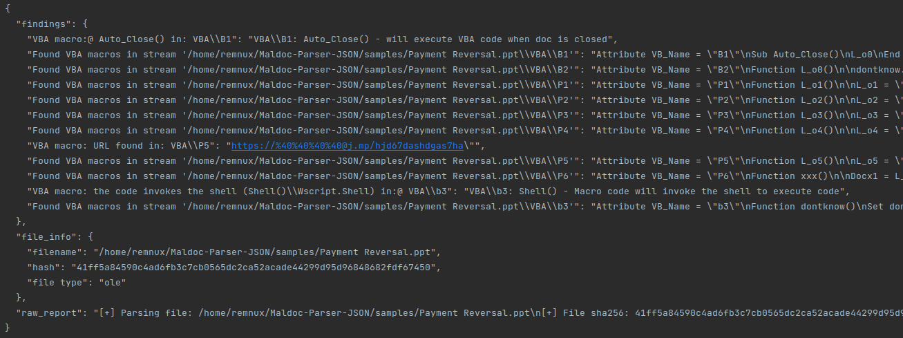

# Maldoc-Parser-JSON
A version of Maldoc-Parser that outputs analysis to a JSON report.

All Python classes and files were unified into one file.




### Installation:
```bash
cd /opt
sudo git clone https://github.com/DanielBres/Maldoc-Parser-JSON.git
cd ./Maldoc-Parser-JSON
sudo pip install -r ./requirements.txt

```

### requirements:
- Tested on Remnux (Ubuntu).
- Pythoin 3.x


### ***This is a work in progress!***
